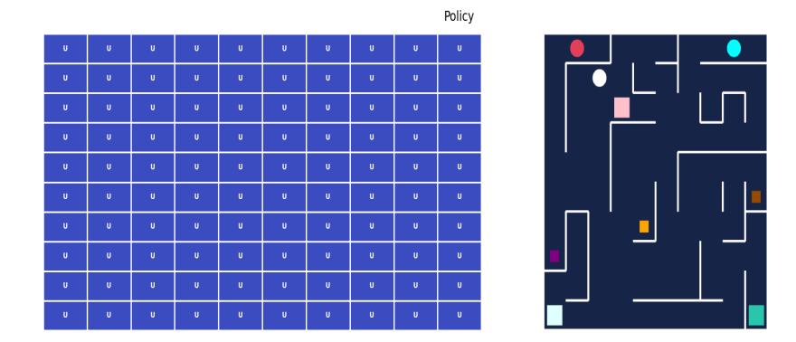

# Reinforcement Learning based object identification and transportation
## Overview

This project is focused on implementating Reinforcement learning in grid world  based agent for object identification and transporation. It demonstrates how intelligent agents can learn optimal pickup and delivery strategies in a simulated environment through trial and error, without explicit programming of routes or behaviors.

The system models a multi-agent grid-based environment, where each agent independently learns to pick up an assigned object and deliver it to a specific destination while avoiding obstacles. The learning process is implemented using Q-learning, a classical reinforcement learning algorithm.

This project was developed as a Major Project in partial fulfillment of the Bachelor of Engineering in Computer Engineering.

## Abstract Summary

This project explores how reinforcement learning can be used to train autonomous agents that learn efficient delivery routes.

A 10×10 grid environment with multiple agents, objects, goals, and obstacles is designed. Each agent learns independently using Q-learning to minimize delivery time and complete pickup-and-drop tasks efficiently. After training an agents successfully converge to optimal policies, demonstrating improved routing and task completion.

## Key Features

* Multi-agent grid-based simulation
* Independent Q-learning for each agent (separate Q-table for each agent)
* Obstacle avoidance 
* Pickup and delivery task modeling
* Visual representation of agent behavior
* Scalable design for future extensions

## System Design
### Environment
* Grid size: 10 × 10
* Agents: 3
* Objects: 3
* Goals: 3
* Obstacles: Static
* Each agent has one corresponding object and goal

### Agent Capabilities
* Move in four directions: up, down, left, right
* Pick up assigned object
* Transport object to goal
* Avoid obstacles

## Reinforcement Learning Approach
### Algorithm Used
* Q-learning (Table-based)

## Learning Strategy

* Independent learning for each agent
* No centralized controller
* Fully observable environment
* Epsilon-greedy policy for exploration and exploitation

## Reward Structure

* Negative reward for each time step to encourage faster delivery
* Zero reward on successful goal completion
* Penalties for invalid moves or collisions

## Training Details
* Q-table size per agent: (10, 10, 4) => (grid size, grid size, number of agents)
* Separate Q-tables for each agent:
    * Agent moving to object
    * Agent carrying object to goal

## Results
### Before Training

* Agents move randomly
* No clear direction toward objects or goals
* Inefficient and delayed deliveries

### After Training

* Agents follow optimized paths
* Successful pickup and delivery
* Reduced travel time
* Effective obstacle avoidance

The results validate that reinforcement learning can successfully train autonomous agents for object transportation tasks.

## Technologies and Concepts Used

* Python
* Reinforcement Learning
* Q-learning
* Multi-Agent Systems
* Markov Decision Process (MDP)
* Grid-based Simulation

## Limitations

* Uses table-based Q-learning, which does not generalize well to large or continuous environments
* Objects and goals are static
* No agent coordination or communication

# Project Team

**Ankrit Risal**  
**Aayush Basnet**  
**Bhuwan Dhakal** 

## Supervisor

**Dr. Dibakar Raj Panta**  
Associate Professor  
Department of Electronics and Computer Engineering, Institute of Engineering, Kathmandu

## Institution

Advanced College of Engineering and Management
Institute of Engineering, Tribhuvan University
Kathmandu, Nepal
2025
